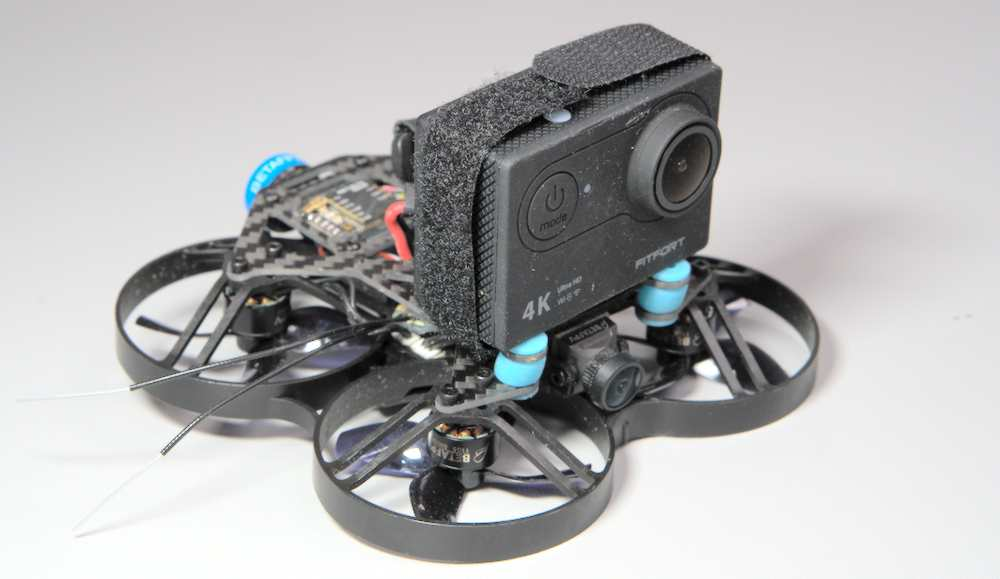

This is my first attempt at flying my [Beta85X V2](https://betafpv.com/collections/beta85x-series-drones/products/beta85x-v2-whoop-quadcopter) with an action cam strapped on top. It involves no small amount of crashing as well as almost getting stuck in a very tall tree, but it survived and made it home to fly another day. 

https://www.youtube.com/watch?v=E6Myad6036o