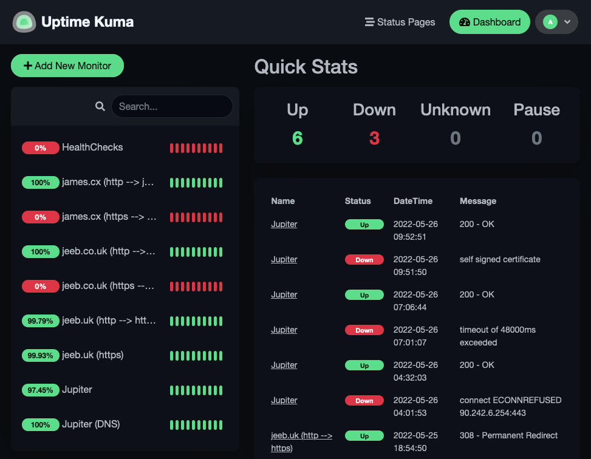

I [host a bunch of services](<../Self Hosting/What I Self Host.md>) on a server in my house, which I call Jupiter ([Why "Jupiter"?](<../Self Hosting/Device Naming.md>)). I also have cron jobs on the server which run important things like [backups of my documents and photos/videos](<../Self Hosting/Backups.md>). I need to know (immediately) if:
- Jupiter goes down
- One of the services on Jupiter is not running
- One of the cron jobs on Jupiter has not run on time or successfully

Running health checks or down-detectors on Jupiter would not be wise as they might not notify me if the whole server was to go down. So I need a 3rd party, outside of my home network, to keep an eye on everything. The watcher would be very compute un-intensive, only hosting a couple of small docker images which don't generally do much, and so I went on the hunt for the cheapest, tiniest VMs/VPSs I could find:
- **Azure** - B1ls (1vCPU, 512MB memory, 4GB storage) = ~£3.50pm
- **GCP** - e2-micro (2vCPU, 1GB memory, 10GB storage) = ~£6pm
- **AWS** - t4g.nano (2vCPU, 512MB memory, 10GB storage) = ~£2pm
- **Hetzner** - CX11 (1vCPU, 2GB memory, 20GB storage) = ~£3.50pm
- **OVH** - Starter (1vCPU, 2GB memory, 20GB storage) = ~£3pm

These costs are all rough estimates, and don't take into account things like paying for reserved capacity up-front & additional costs for public IPs. But they give a good indicator that at the very least, it would be a cost of around £3pm.

But then I remembered that some of the bigger cloud providers offer "always free" tiers. And they have compute resources as part of that offering:
- **[Azure Free Tier]()** - Azure App Service (10 apps with 1GB free)
- **[AWS Free Tier](https://aws.amazon.com/free)** - AWS Lambda (1 Million requests per month)
- **[Oracle Cloud Free Tier](https://www.oracle.com/uk/cloud/free/)** - VM (1/8 OCPU, 1GB memory)
- **[GCP Free Tier](https://cloud.google.com/free)** - VM (e2-micro, )