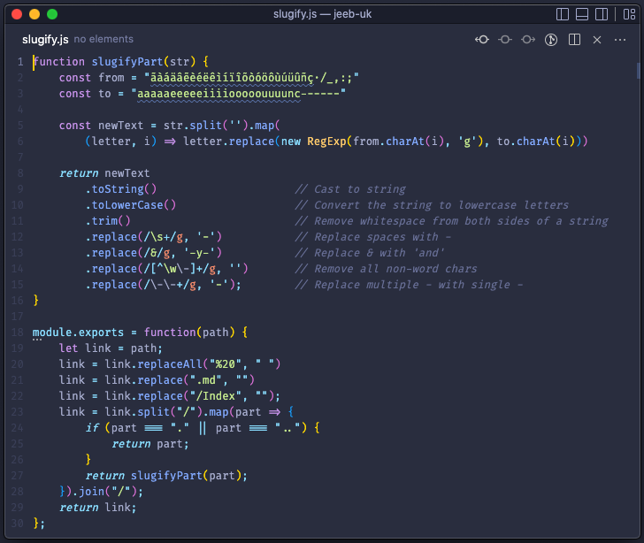

- **IDE:** [VSCode Insiders](https://code.visualstudio.com/insiders/)
	- VSCode allows for incredible amounts of customisation of the UI. As I spend a huge chunk of my working day in this application, I have got a big list of changes to the UI which suit me. You can see my dotifles for VSCode [here](https://github.com/jmc265/dotfiles/tree/master/software/vscode).
	- [My plugins for VSCode](https://github.com/jmc265/dotfiles/blob/master/install-tools-mac.sh)
- **Endpoint testing:** [Insomnia](https://insomnia.rest/)
- **Source Control:** Git with [Fork](https://git-fork.com/) when VSCode internal SCM isn't enough

Also see: [Terminal](./Terminal.md)